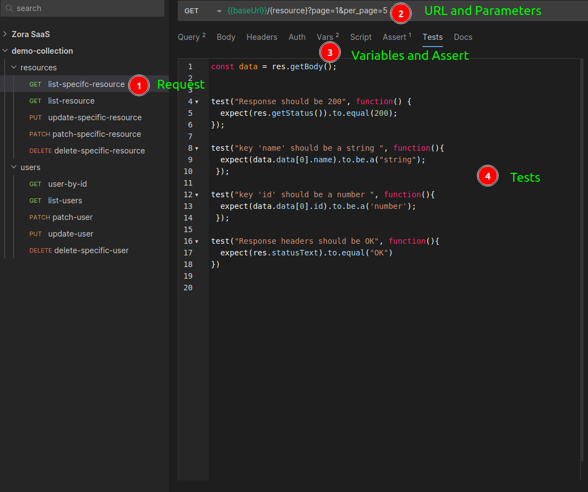

# bruno-api-testing
Demo how to test API using Bruno   

Bruno is an open-source alternative for API testing. We can use Bruno instead of Postman, Insomnia, etc.  

Using Bruno we can manage the requests, with facility, in separate files. There is one file for each request. In Postman, there is a unique JSON file for all tests. For example, if we change just the value of variables, we have that generate a new collection and replace the whole JSON file. Normally this is the process.   

Instead of, storing collections in the cloud, and should be necessary to create an account to use the toll, Bruno uses the file system locally and we can use the version control system and all teams have access to API.  

>[!TIP]  
> [Read a Bruno Manifesto](https://docs.usebruno.com/introduction/manifestohttps://docs.usebruno.com/introduction/manifesto)   

###  Bru lang    

Is a DSL with readable syntax and it is easy to maintain. From Bruno UI, will create a file with the extension `.bru` for each request in your collection directory.   

    

The file `.bru`, with syntax Bru Lang generated from the test above:  
  

  
