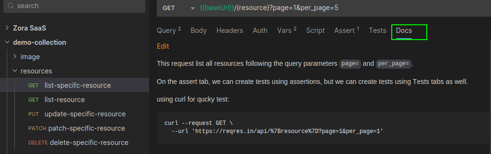

# bruno-api-testing
How to test API using Bruno    

> [!TIP]  
> [Check how can test api with Go](test/readme.md)   

Bruno is an open-source alternative for API testing. We can use Bruno instead of Postman, Insomnia, etc. It is available for Linux, Windows and MacOS. For download, use access [Bruno](https://www.usebruno.com/).

Using Bruno we can manage the requests with facility, in separate files. There is one file for each request. In Postman, there is a single JSON file for all tests and all requests. For example, if we change just the value of variables, we have that generate a new collection and replace the whole JSON file. Normally, this is the process.    

  

Instead of, storing collections in the cloud, and create account to use the toll, Bruno uses the filesystem and we can use the version control system and all teams have access to API.  

> [!TIP]  
> [Read a Bruno Manifesto](https://docs.usebruno.com/introduction/manifesto)   

##  Bru lang    

Is a domain-specific language (DSL) with readable syntax and it is easy to maintain. From Bruno UI, automatically creates a file with the extension `.bru` for each request in your collection directory.

Let's see an example, first create a test using Bruno UI:  

  

The file `.bru`, with syntax Bru Lang generated from the test above.  

Now, we can see the bru lang:   

  

If the request was POST method, will be added a new field in the file:   

  

  

## Product Area     

With tools like Bruno, we can test functionality, business rules, and expected responses, and use this information in prototypes. But it can be possible if we have good documentation. Then, we can write descriptions for each request, Bruno accepting markdown.    

Example in the UI:    

  

 

Like the example below, in the file `.bru` the field doc has been created.  

  

 

## CLI    

We can run tests using CLI. It is a great feature for CI/CD.  

Just install Node, and Bruno CLI using the command: ` npm install -g @usebruno/cli` . Then, execute the tests using `bru run`. See the results below:   

  

  

For all options, run `bru run --help`.   

> [!TIP]  
> [Check all possibilities](https://docs.usebruno.com/bru-cli/overview)  

